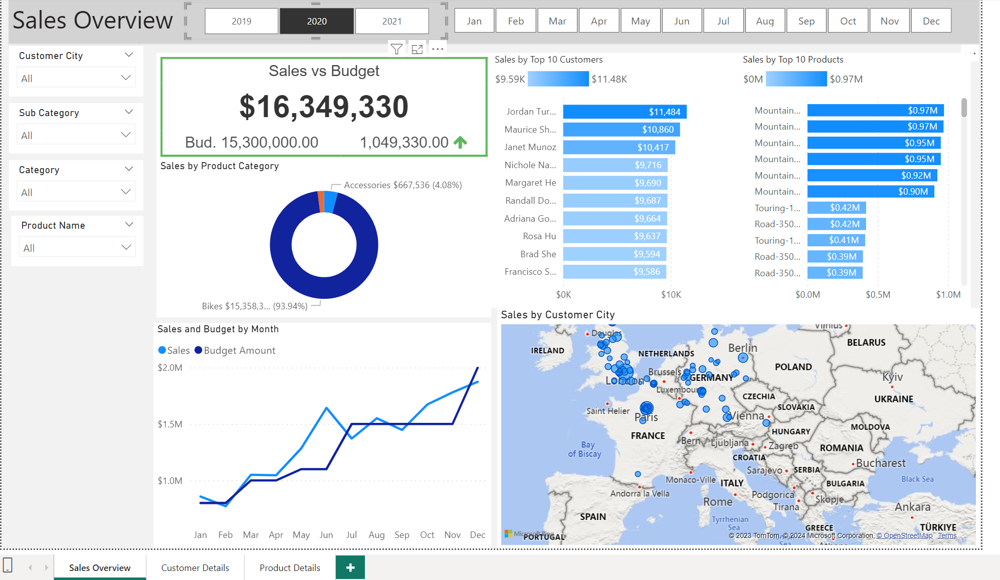
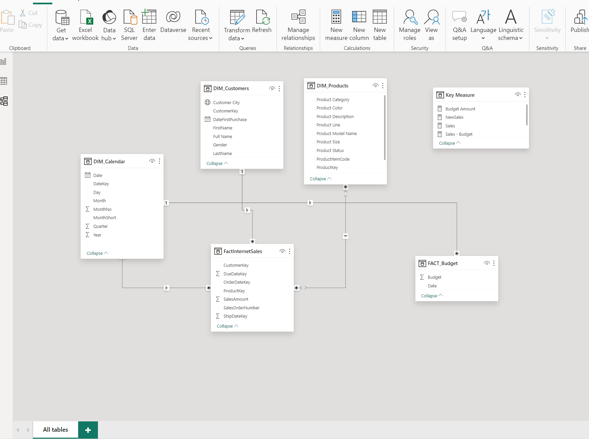
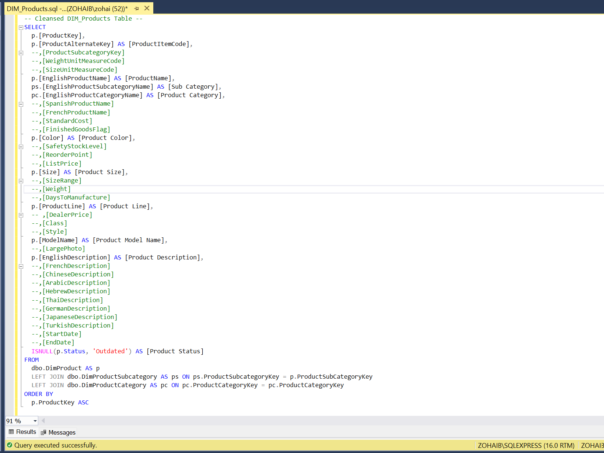
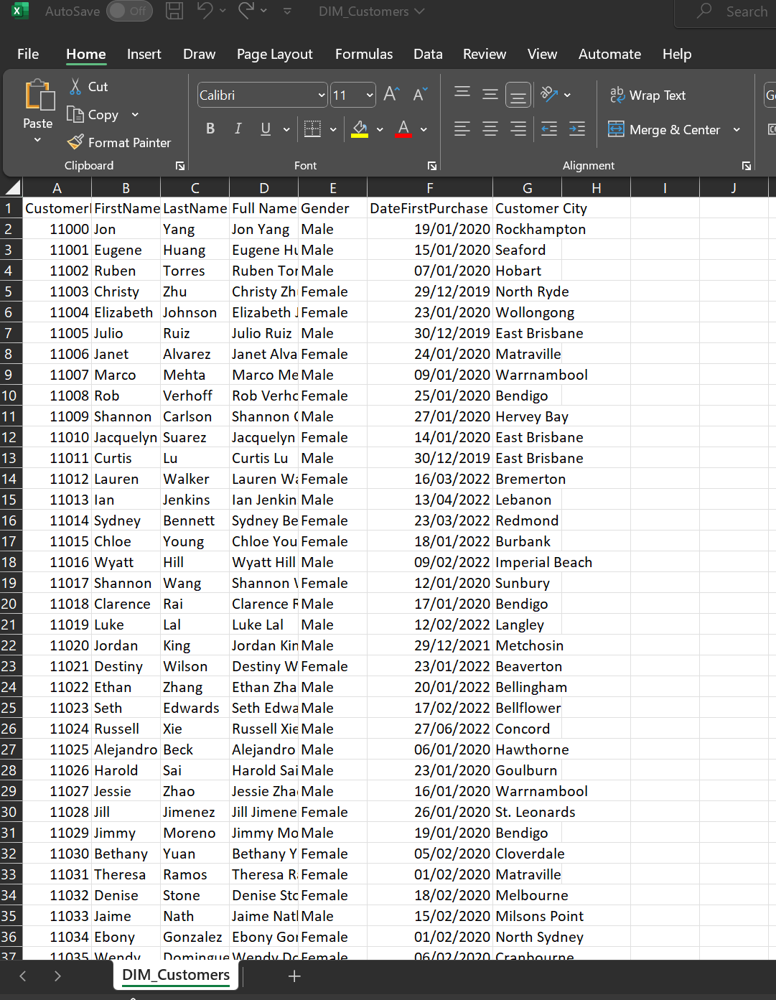

| Sales Dashboard | Data Model Image |
| --- | --- |
|  |  |

| SQL Statements | CSV |
| --- | --- |
|  |  |

# Business Request & User Stories

The business request for this data analyst project was an executive sales report for sales managers. Based on the request that was made from the business, the following user stories were defined to fulfill delivery and ensure that acceptance criteria were maintained throughout the project.

## User Stories

| # | Role               | Request                                            | User Value                                             | Acceptance Criteria                                  |
|---|--------------------|----------------------------------------------------|--------------------------------------------------------|------------------------------------------------------|
| 1 | Sales Manager      | To get a dashboard overview of internet sales      | Can follow better which customers and products sell the best | A Power BI dashboard which updates data once a day   |
| 2 | Sales Representative | A detailed overview of Internet Sales per Customers | Can follow up my customers that buy the most and who we can sell more to | A Power BI dashboard which allows me to filter data for each customer |
| 3 | Sales Representative | A detailed overview of Internet Sales per Products  | Can follow up my Products that sell the most             | A Power BI dashboard which allows me to filter data for each Product |
| 4 | Sales Manager       | A dashboard overview of internet sales             | Follow sales over time against budget                    | A Power Bi dashboard with graphs and KPIs comparing against budget |

## Data Cleansing & Transformation (SQL)
The following tables were retrieved using SQL in order to generate the required data model for conducting analysis and meeting the business needs outlined in the user stories.
Sales budgets, one data source, were supplied in Excel format and, at a later stage of the procedure, were linked in the data model.
The SQL statements for transforming and cleaning the required data are listed below.

### DIM_Calendar:

```sql
-- Cleansed DIM_Date Table --
SELECT 
  [DateKey], 
  [FullDateAlternateKey] AS Date, 
  -- [DayNumberOfWeek], 
  -- [EnglishDayNameOfWeek] AS Day, 
  -- [SpanishDayNameOfWeek], 
  -- [FrenchDayNameOfWeek], 
  -- [DayNumberOfMonth], 
  -- [DayNumberOfYear], 
  -- [WeekNumberOfYear],
  [EnglishMonthName] AS Month, 
  Left([EnglishMonthName], 3) AS MonthShort,   -- Useful for front end date navigation and front end graphs.
  -- [SpanishMonthName], 
  -- [FrenchMonthName], 
  [MonthNumberOfYear] AS MonthNo, 
  [CalendarQuarter] AS Quarter, 
  [CalendarYear] AS Year -- [CalendarSemester], 
  -- [FiscalQuarter], 
  -- [FiscalYear], 
  -- [FiscalSemester] 
FROM 
  [AdventureWorksDW2019].[dbo].[DimDate]
WHERE 
  CalendarYear >= 2019;
